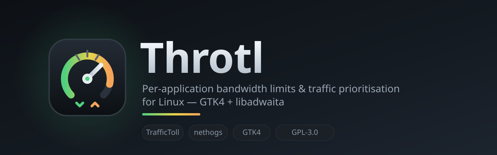
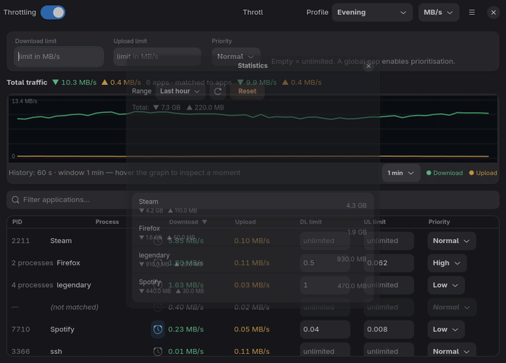
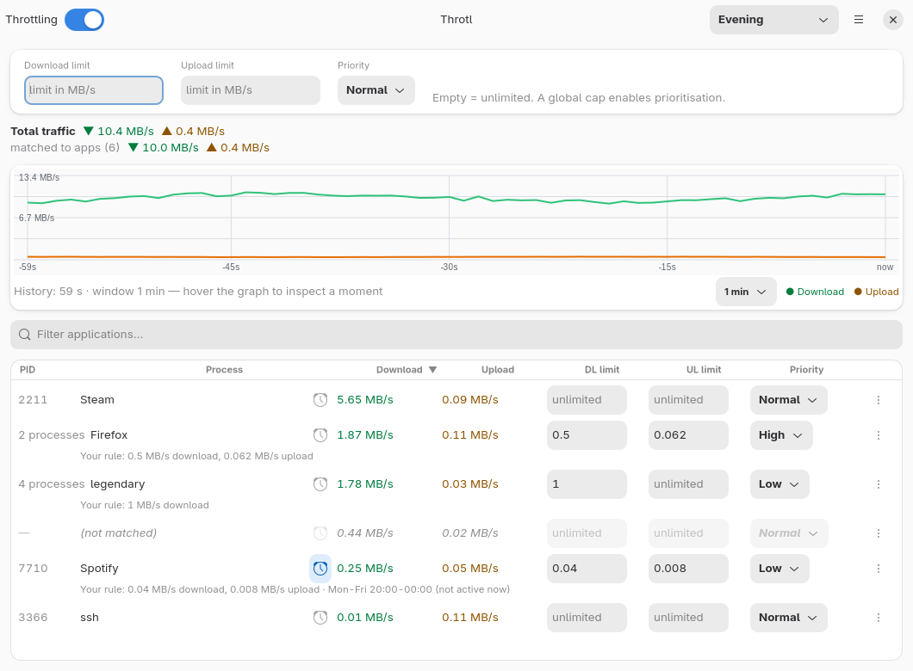
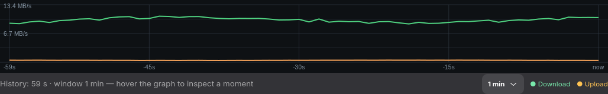
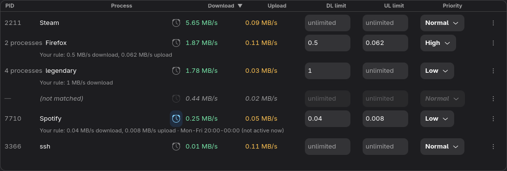
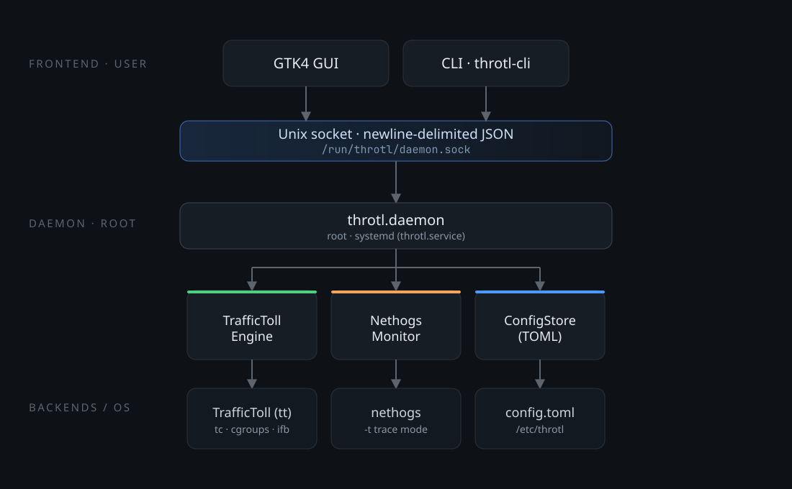
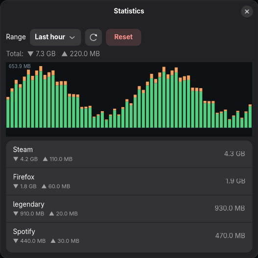
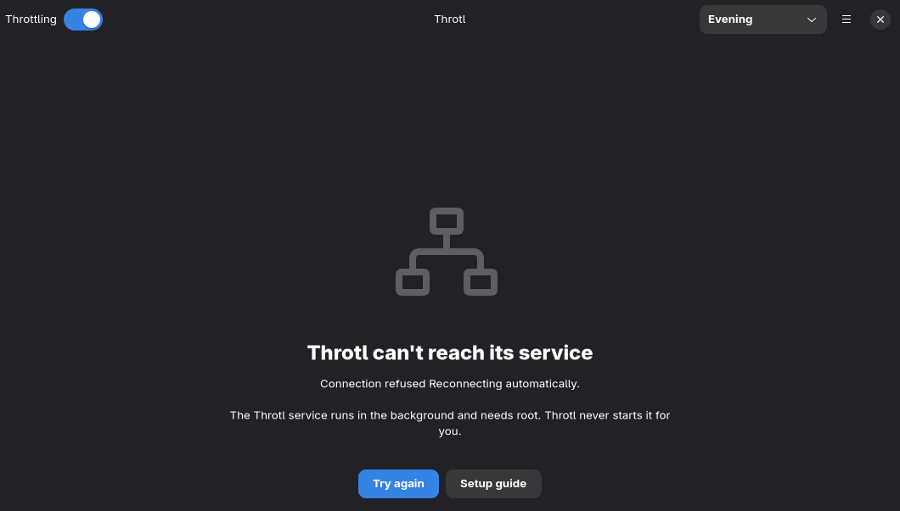

# Throtl



**Per-application bandwidth limits and traffic prioritisation for Linux.**

[](https://github.com/Flenser42/throtl/actions/workflows/ci.yml)
[](LICENSE)
[](pyproject.toml)
[](#requirements)

Throtl brings fine-grained bandwidth control to Linux/Omarchy: set per-application
download/upload limits and traffic priorities from a native GTK4 + libadwaita
app, or from a scriptable CLI — without reinventing the shaping engine.

It is a thin, well-behaved layer on top of two proven tools:

- **[TrafficToll](https://github.com/cryzed/TrafficToll)** (`tt`) does the actual
  `tc`/cgroup shaping and runs as a managed subprocess.
- **[nethogs](https://github.com/raboof/nethogs)** in trace mode provides live
  per-process bandwidth.



*Live view: per-app rates, editable limits and priority, auto-scrolling graph.*

### Light & dark

Throtl follows your system style by default and can be pinned from the main
menu:



---

## Features

- **Per-application limits** — download/upload caps for a single app, even when
  it runs many processes (they are grouped into one row and summed).
- **Time windows** — give any rule a weekday + time window ("Firefox,
  Mon–Fri 20:00–00:00"); the rule only applies inside it. Windows across
  midnight work, and the engine re-applies automatically when a window opens
  or closes.
- **Priorities** — Critical / High / Normal / Low for individual apps, plus a
  global default priority for everything that has no rule.
- **Live graph** — download/upload over time on a real time axis. Shows the last
  60 s by default and auto-scrolls; switch the window to 30 s / 1 min / 5 min /
  15 min / All and scroll back through history at any time.
- **Live process table** — per-app rates, editable limits and priority, sortable
  columns, colour-coded up/down values, and a filter box to focus on one app.
- **Global switch** — turn all shaping on/off without losing your rules.
- **Consumption budgets** — a rolling daily/weekly volume limit (global or per
  app); the GUI warns and shows a desktop notification when it is exceeded.
- **Budgets, editable in the app** — main menu → **Budgets…** sets the global
  daily/weekly volume and per-application budgets, showing how much is already
  used. A warning arrives at 80 % of a budget, so there is still time to react.
- **Explains itself** — every affected row says which rule applies (own limit,
  global limit, time window and whether it is active right now).
- **Knows when the service is missing** — if the daemon is not reachable, the
  window shows a status page with **Try again** and **Setup guide** instead of an
  empty table.
- **Statistics** — persistent per-app history over 1 h / 2 days / 30 days,
  shown as a table and a graph.
- **Profiles, schedules & startup profile** — save the current limits as named
  profiles ("University", "Evening", "Night"), switch between them automatically by
  weekday and time, and pick one to activate on daemon startup.
- **Native GNOME design** — built on libadwaita and following your system
  light/dark preference (or pin Light/Dark in the main menu); the graph and
  rate colours adapt with it.
- **Responsive** — TrafficToll restarts are coalesced and happen off the UI
  thread, so the window never freezes while a change is applied.
- **Headless CLI** — everything the GUI can do, plus `monitor`, `top`,
  `watch` (a timed report with an optional alert threshold) and a simulation
  mode that needs neither root nor TrafficToll.
- **Local only** — a Unix socket, no network port. The one outbound request is
  the optional update check (below).
- **Update notice** — tells you when a newer release exists and opens its page
  in your browser. Throtl never installs anything by itself.

### Graph



### Process table



---

## How it works



- The **privileged daemon** (`throtl-daemon`) runs as `root` via systemd
  (`throtl.service`) because `tc`, the IFB device and `nethogs` need
  root.
- The **IPC** is a local Unix socket
  (`/run/throtl/daemon.sock`) carrying newline-delimited JSON. No TCP
  port is opened.
- **Configuration** is persisted as TOML: `/etc/throtl/config.toml`
  under systemd, or `~/.config/throtl/config.toml` for manual runs.
  The GUI reads it **only** through the daemon API, never from the file.

### How limits take effect

TrafficToll reads its YAML config once at startup and installs the `tc` filters
for the matched processes; it has no `SIGHUP` reload. Throtl therefore writes the
current config and **restarts the `tt` subprocess on every change**:

```
change (GUI/CLI) ──► render YAML ──► stop tt ──► start tt
```

This is the most reliable path and does not require restarting the target
application — the `tc` rules apply immediately on the interface.

### How priorities behave

Priority numbers map as Critical `0` … Low `3` (lower = served first). The
**global priority** is the class used for traffic that matches no per-app rule.
Prioritisation only has a visible effect when the link is **saturated** *and* a
**global download/upload cap** is set — otherwise TrafficToll runs at line rate
and there is no queue to prioritise. The GUI hint states this as well.

Throtl sets download and upload priority together from a single control.

### Monitoring semantics

Throtl runs nethogs in trace mode with **`-v 1`** (cumulative kB per process)
and computes the rate itself from the delta between two ticks over a monotonic
clock. nethogs' built-in rate mode divides by its assumed `PERIOD` and drifts
badly under load (we measured 2.0 MB/s reported while the kernel and the
application showed ~2.5 MB/s for the same traffic), so the deltas are used
directly. nethogs counts KiB (1024-byte units), which Throtl converts to its
internal kbit/s schema. Traffic that cannot be attributed to a process is kept
as a synthetic `(unattributed)` row instead of being dropped.

---

## Requirements

- Linux (developed on **Arch / [Omarchy](https://omarchy.org)**, Wayland)
- Python **3.11+**
- `nethogs`, `gtk4`, `libadwaita`, `python-gobject`, `python-cairo`
  (all in Arch `[extra]`)
- [`traffictoll`](https://github.com/cryzed/TrafficToll) — installed by the setup
  script into a venv under `/opt/throtl`
- `tc` and the `ifb` kernel module (for ingress shaping)

The backend itself has **no third-party Python dependencies**; the GUI uses the
system PyGObject.

---

## Installation

```bash
git clone https://github.com/Flenser42/throtl.git
cd throtl
sudo ./setup/install.sh
```

The script:

1. installs the system packages listed above,
2. creates `/opt/throtl/venv` and installs `traffictoll`,
3. copies the code and launchers to `/opt/throtl` (and symlinks
   `throtl-cli` / `throtl-gui` / `throtl-daemon` into `/usr/local/bin`),
4. creates `/etc/throtl/config.toml` and `/run/throtl`,
5. installs and starts the `throtl` systemd service,
6. installs the desktop entry, the icon and offers autostart.

Uninstall with `sudo ./setup/uninstall.sh` (add `--purge` to also remove code
and configuration).

> **Prebuilt artifacts / distro packages:** Throtl is pure Python, so there is
> nothing to compile. Every release carries an sdist, a wheel and a **Debian
> `.deb`** (build it locally with `make deb`), and there is an AUR `PKGBUILD`
> for Arch/Omarchy. See [`packaging/README.md`](packaging/README.md).

> The daemon and engine need root, so Throtl installs system-wide. The frontend
> (GUI/CLI) runs as your user and talks to the daemon over the Unix socket.

---

## Usage

### GUI

Open **Throtl** from your launcher, or:

```bash
/opt/throtl/bin/throtl-gui
```

The window gives you a global on/off switch, the active profile, global limits
and priority, the live graph and the per-app table. Type a limit into a row's
`DL limit` / `UL limit` field (empty = unlimited) and pick a priority; the change
is sent to the daemon automatically.

Each row explains itself: underneath an application that is affected by
something, a quiet line says **why** — `Your rule: 0.5 MB/s download, 0.062 MB/s
upload` or `Your rule: 0.04 MB/s download · Mon-Fri 20:00-00:00 (not active
now)`. Rows that are unlimited stay one line, so only the interesting ones
grow. The `⋯` button on a row opens its actions: set a budget for exactly that
application, or edit its time window.

> Limits are displayed and interpreted in the selected unit (MB/s, Mbit/s, KB/s,
> kbit/s). An explicit suffix such as `2 kbps` always wins over the unit.

#### Keyboard

| Shortcut | Action |
|---|---|
| `Ctrl+R` | Reload settings and the process list |
| `Ctrl+I` | Open Statistics |
| `Ctrl+S` | Save the current settings as a profile |
| `Ctrl+F` | Focus the application filter |
| `Esc` | Clear the filter |
| `Ctrl+1` … `Ctrl+9` | Activate the n-th profile |
| `Alt+D` / `Alt+U` / `Alt+P` | Jump to the download limit, upload limit, priority field |

### Updates

On start, Throtl asks the public GitHub release API which version is current
and shows a banner when yours is older — *“Throtl 0.9.0 is available (installed:
0.8.0)”* — with a **Download** button that opens the release page in your
browser. Throtl never downloads or installs anything, needs no root for this and
asks nothing of the daemon.

This is the only outbound request the app makes. It carries no account, no
identifier and no usage data — just a GET for the latest tag. Switch it off in
the main menu under **Updates → Check for updates on start**; **Check for
updates** runs it once on demand.

### CLI

The daemon is fully controllable without the GUI:

```bash
throtl-cli status
throtl-cli list-processes

# Global caps (2 Mbit/s down, 1 Mbit/s up)
throtl-cli set-global --download-limit 2mbps --upload-limit 1mbps
throtl-cli set-global --download-priority hoch

# Rule for Firefox
throtl-cli set-process --name Firefox --exe /usr/lib/firefox/firefox \
    --download-limit 2mbps --priority hoch

# Only throttle Firefox on weekdays between 20:00 and midnight
throtl-cli set-process --name Firefox --exe /usr/lib/firefox/firefox \
    --download-limit 1mbps --window-days mo-fr \
    --window-start 20:00 --window-end 00:00

throtl-cli remove-process --key 'exe:/usr/lib/firefox/firefox'

throtl-cli toggle --enabled false      # pause all shaping
throtl-cli monitor                     # live rates, once per second
throtl-cli top                         # full-screen live ranking (htop-style)

# Timed report for scripting; exit code 4 if an app exceeds the threshold
throtl-cli watch --duration 30 --alert 5mbps
throtl-cli watch --duration 10 --app firefox --json

# End-to-end check that limits actually throttle (needs root + TrafficToll)
throtl-cli selftest --limit 2mbps

# Profiles
throtl-cli profiles                    # list profiles (+ active)
throtl-cli profile-save University            # save current settings as "University"
throtl-cli profile-use University             # activate "University"
throtl-cli profile-delete University

# Activate a profile automatically when the daemon starts
throtl-cli start-profile University
throtl-cli start-profile                # show the current startup profile
throtl-cli start-profile --clear

# Statistics: last hour, last two days or last 30 days
throtl-cli stats --window minute
throtl-cli stats --window day

# Consumption budgets (rolling last 24 h / last 7 days)
throtl-cli budget-set --day 20gb --week 100gb
throtl-cli budget-set --app firefox --day 5gb
throtl-cli budgets
throtl-cli budget-remove --app firefox

# Export/import the whole configuration, and diagnose the host
throtl-cli export --output throtl.toml
throtl-cli import throtl.toml
throtl-cli doctor
```

### Profiles & schedules

A **profile** is a named snapshot of the global limits and all process rules.
The top-level `global`/`processes` are always the *active view* (v0.1.0
compatibility), so the GUI and CLI keep working unchanged. Profiles live
additively next to them in `config.toml`:

```toml
active_profile = "Standard"

[profiles.University]
global_download_limit = 2048
global_upload_limit = 512
global_priority = "hoch"

[[profiles.University.processes]]
name = "Spotify"
match_type = "exe"
match_value = "spotify"
download_limit = 512
priority = "niedrig"

[[schedule]]
profile = "University"
days = ["Mon", "Tue", "Wed", "Thu", "Fri"]
start = "08:00"
end = "14:00"
```

The daemon checks the schedule once per monitoring tick and activates the
first matching profile automatically (only when `schedule` is non-empty).
`days` accepts `mo`…`so` (Mo = 0), ranges like `"mo-fr"`, and English names;
overnight rules (`end < start`) run until the next morning.

A **startup profile** is the fallback for when no schedule matches:

```toml
start_profile = "University"
```

It is applied once when the daemon starts; a schedule that matches at that
moment still takes priority.

### Time windows (per rule)

Individual rules can be limited to a weekday + time window. Add a `window` to
a rule in `config.toml` (flat form shown here):

```toml
[[processes]]
name = "Firefox"
match_type = "exe"
match_value = "/usr/lib/firefox/firefox"
download_limit = 1024
priority = "normal"
window_days = ["Mon", "Tue", "Wed", "Thu", "Fri"]
window_start = "20:00"
window_end = "00:00"       # before start -> runs across midnight
```

Inside the window the rule is applied as usual; outside it the rule is left
out of the generated TrafficToll config, so the app is unthrottled. The daemon
re-applies automatically on the transition (once per monitoring tick). In the
GUI, the small clock button in each row opens the window editor; `Clear`
removes the window. The CLI accepts `--window-days` / `--window-start` /
`--window-end` (and `--clear-window`).

### Statistics

The daemon accumulates, per monitoring tick, the download/upload volume of
every application into three rolling windows and stores them as
`<config_dir>/stats.json`:

| Window | Bucket | Kept |
|--------|--------|------|
| `minute` | 1 minute | 1 hour |
| `hour` | 1 hour | 2 days |
| `day` | 1 day | 30 days |

The GUI exposes this under **Statistics…** (window switcher + per-app list and
history graph); the CLI prints it with `throtl-cli stats`. Stored values are
**bytes**, derived from the sampled rates — see [`docs/TESTING.md`](docs/TESTING.md)
for the accuracy limits.



### Simulation mode

For a quick look without root or TrafficToll:

```bash
throtl-daemon --simulate --socket /tmp/throtl.sock &
throtl-cli --socket /tmp/throtl.sock status
throtl-cli --socket /tmp/throtl.sock set-global --download-limit 2mbps
```

---

## Verifying that limits really work

There are two layers:

1. **Did the config reach TrafficToll?** `throtl-cli status` shows preflight
   warnings and the engine state; `systemctl status throtl` and the
   files under `/etc/throtl` show the details.
2. **Is bandwidth actually throttled?** Add a rule for your test tool and measure
   the real rate:

   ```bash
   throtl-cli set-process --name curl --exe /usr/bin/curl \
       --download-limit 512kbps --priority normal

   curl -o /dev/null -w 'Speed: %{speed_download} B/s\n' \
        https://example.com/bigfile.bin
   ```

Without a real interface to shape, the simulation mode above is enough to test
the control flow.

See [`docs/TESTING.md`](docs/TESTING.md) for manual test recipes and known
limitations.

---

## Security

- **Local Unix socket only** — no TCP port. The socket lives in
  `/run/throtl/` and is owned by `root:throtl` with mode `0660`, so only
  members of the `throtl` group (added by `install.sh`) can reach the root
  daemon. Access is purely local; there is no network listener.
- The frontend can only set limits and priorities via the API; there is **no
  arbitrary shell access** over the socket.
- The TrafficToll YAML is rendered deterministically; `exe`/`name` match values
  are escaped, `cmdline` is explicitly a regex.
- The systemd unit deliberately runs without additional sandboxing because
  `nethogs` needs `cap_sys_ptrace`/`cap_dac_read_search` and the engine needs
  `CAP_NET_ADMIN`; the reasoning is documented inline in the unit file.

---

## Project layout

```
throtl/
  __init__.py        path/app constants
  units.py           kbit/s schema, rate/size parse/format
  protocol.py        IPC: JSON over Unix socket, client with reader thread
  config.py          TOML schema, priorities, rules, profiles, schedules,
                     time windows, rule/persistence helpers
  monitor.py         nethogs cumulative-mode parser + NethogsMonitor
  engine.py          TrafficToll YAML renderer + tt process + SimEngine
  budgets.py         rolling daily/weekly volume budgets
  stats.py           persistent per-app history (ring buffers, 3 windows)
  daemon.py          Unix-socket RPC daemon (root)
  cli.py             CLI (throtl-cli)
  gui/               GTK4 + libadwaita frontend (app, graph, process table,
                     rule-window dialog, prefs, style.css)
tests/               unittest suite (GUI tests run under Xvfb)
setup/               install/uninstall, systemd unit, .desktop, autostart
packaging/           AUR PKGBUILD, Debian .deb builder + distro notes
data/                icon (SVG)
docs/                TESTING.md, RELEASING.md
docs/images/         banner, architecture diagram and screenshots
```

---

## Development

```bash
make check          # ruff + full unittest suite
make test            # python3 -m unittest discover -s tests (GUI tests skip headless)
make lint            # ruff check .
make lint-fix        # ruff autofixes (imports/formatting)
make build           # sdist + wheel into dist/ (needs `build`)
make deb             # Debian package into dist/ (needs `dpkg-deb`)

# Run the GUI widget tests on a headless machine
xvfb-run -a -s "-screen 0 1280x900x24" make test

# Regenerate the README screenshots / demo GIF (uses the Xvfb trick above)
make images
```

- Prefer the **system Python** for GUI tests (`/usr/bin/python3`), since a
  virtualenv typically lacks PyGObject. The `Makefile` does this automatically.
- GUI widget tests and `make images` are skipped when no display is available.
- Run `make clean` to drop build artifacts and caches.

See [`CONTRIBUTING.md`](CONTRIBUTING.md) and [`docs/RELEASING.md`](docs/RELEASING.md);
the project follows [`CODE_OF_CONDUCT.md`](CODE_OF_CONDUCT.md) and has a
[`SECURITY.md`](SECURITY.md) policy.

---

## Troubleshooting

The window tells you when the service is missing instead of showing an empty
table:



- **No process list in the GUI** — the daemon could not start `nethogs`. Check
  `throtl-cli status` (`Monitor error`) and `systemctl status throtl`.
- **Limits don't seem to apply** — verify the interface. Throtl auto-detects the
  default-route interface; for VPN tunnels pin it explicitly:
  `throtl-daemon --interface tailscale0`.
- **Prioritisation does nothing** — set global download/upload caps; see
  [How priorities behave](#how-priorities-behave).
- **`tt` not found** — re-run `sudo ./setup/install.sh` (it installs TrafficToll
  into `/opt/throtl/venv`).
- **`Permission denied` on the socket / "daemon not reachable"** — the daemon
  socket belongs to the `throtl` group. `install.sh` added you to it, but a
  *running* session keeps its old groups: run `newgrp throtl` in the terminal or
  log out and back in. `throtl-cli doctor` detects exactly this.

---

## A small request

Throtl is free software. The [GPL-3.0-or-later](LICENSE) explicitly permits
commercial use, and you are **not** required to tell me anything. But if you do
use Throtl commercially, I would honestly love to hear about it — where it ends
up and how big it grows. That is pure curiosity, not a license condition.

A short note — an issue or a [discussion](https://github.com/Flenser42/throtl/discussions)
is more than enough, and keeps my inbox clean.

---

## License

Throtl is licensed under **GPL-3.0-or-later** (see [`LICENSE`](LICENSE)).
Commercial use is allowed — see [A small request](#a-small-request).

### Third-party components

Throtl does not vendor or modify its backends; it installs and drives them as
separate programs, so their licenses do not restrict Throtl's own licensing:

| Component | License | How Throtl uses it |
|-----------|---------|--------------------|
| [TrafficToll](https://github.com/cryzed/TrafficToll) | GPL-3.0 | installed unmodified via `pip` into a venv (`/opt/throtl/venv`) and run as a subprocess through its CLI |
| [nethogs](https://github.com/raboof/nethogs) | GPL-2.0 | system package, run as a subprocess; Throtl parses its `-t` output |

Throtl is an independent frontend, **not a fork** of either project. Running a
separate program and parsing its output is generally not considered creating a
derivative work; even a real fork would be permitted by the GPL, but would carry
the usual obligations (keep the license and notices, publish the source).

> This is not legal advice.
