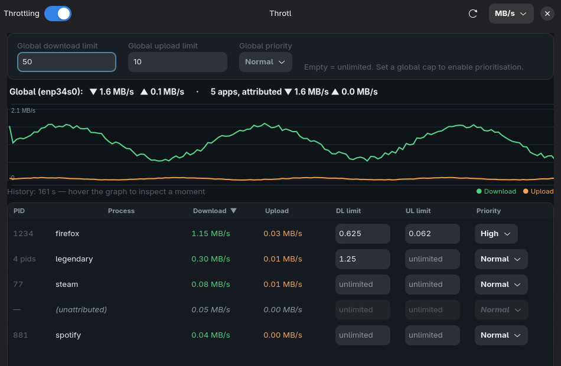
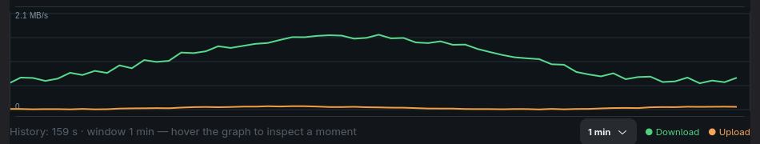
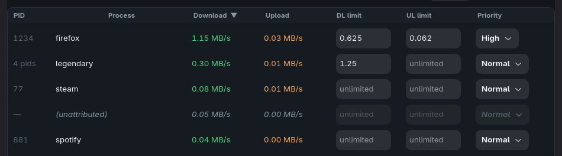

# Throtl

**NetLimiter-style per-application bandwidth limits and traffic prioritisation for Linux.**

[](https://github.com/Flenser42/throtl/actions/workflows/ci.yml)
[](LICENSE)
[](pyproject.toml)
[](#requirements)

Throtl brings NetLimiter-style control to Linux/Omarchy: set per-application
download/upload limits and traffic priorities from a native GTK4 + libadwaita
app, or from a scriptable CLI — without reinventing the shaping engine.

It is a thin, well-behaved layer on top of two proven tools:

- **[TrafficToll](https://github.com/cryzed/TrafficToll)** (`tt`) does the actual
  `tc`/cgroup shaping and runs as a managed subprocess.
- **[nethogs](https://github.com/raboof/nethogs)** in trace mode provides live
  per-process bandwidth.



---

## Features

- **Per-application limits** — download/upload caps for a single app, even when
  it runs many processes (they are grouped into one row and summed).
- **Priorities** — Critical / High / Normal / Low for individual apps, plus a
  global default priority for everything that has no rule.
- **Live graph** — download/upload over time on a real time axis. Shows the last
  60 s by default and auto-scrolls; switch the window to 30 s / 1 min / 5 min /
  15 min / All and scroll back through history at any time.
- **Live process table** — per-app rates, editable limits and priority, sortable
  columns, colour-coded up/down values.
- **Global switch** — turn all shaping on/off without losing your rules.
- **Headless CLI** — everything the GUI can do, plus a live monitor and a
  simulation mode that needs neither root nor TrafficToll.
- **Local only** — a Unix socket, no network port.

### Graph



### Process table



---

## How it works

```
┌────────────────────────────┐          ┌───────────────────────────────┐
│  Frontend (GUI or CLI)     │          │  Daemon (root, systemd)       │
│  GTK4 + libadwaita         │          │  throtl.daemon                │
└────────────┬───────────────┘          └──────────────┬────────────────┘
             │  Unix socket /run/…/daemon.sock          │
             │  JSON, newline-delimited (throtl.protocol)│
             └───────────────► IPC ◄────────────────────┘
                     ┌──────────────┴──────────────┐
                     │  TrafficTollEngine (tt)      │  throtl.engine
                     │  NethogsMonitor (nethogs -t) │  throtl.monitor
                     │  ConfigStore (TOML)          │  throtl.config
                     └──────────────────────────────┘
```

- The **privileged daemon** (`throtl-daemon`) runs as `root` via systemd
  (`netlimiter-clone.service`) because `tc`, the IFB device and `nethogs` need
  root.
- The **IPC** is a local Unix socket
  (`/run/netlimiter-clone/daemon.sock`) carrying newline-delimited JSON. No TCP
  port is opened.
- **Configuration** is persisted as TOML: `/etc/netlimiter-clone/config.toml`
  under systemd, or `~/.config/netlimiter-clone/config.toml` for manual runs.
  The GUI reads it **only** through the daemon API, never from the file.

### How limits take effect

TrafficToll reads its YAML config once at startup and installs the `tc` filters
for the matched processes; it has no `SIGHUP` reload. Throtl therefore writes the
current config and **restarts the `tt` subprocess on every change**:

```
change (GUI/CLI) ──► render YAML ──► stop tt ──► start tt
```

This is the most reliable path and does not require restarting the target
application — the `tc` rules apply immediately on the interface.

### How priorities behave

Priority numbers map as Critical `0` … Low `3` (lower = served first). The
**global priority** is the class used for traffic that matches no per-app rule.
Prioritisation only has a visible effect when the link is **saturated** *and* a
**global download/upload cap** is set — otherwise TrafficToll runs at line rate
and there is no queue to prioritise. The GUI hint states this as well.

Throtl sets download and upload priority together from a single control.

### Monitoring semantics

In `-t` mode nethogs prints `Name/pid/uid<TAB>sent<TAB>recv` per tick; per its
source, the first value is upload and the second is download. Throtl converts
both to an internal kbit/s schema. Traffic that cannot be attributed to a
process is kept as a synthetic `(unattributed)` row instead of being dropped.

---

## Requirements

- Linux (developed on **Arch / [Omarchy](https://omarchy.org)**, Wayland)
- Python **3.11+**
- `nethogs`, `gtk4`, `libadwaita`, `python-gobject`, `python-cairo`
  (all in Arch `[extra]`)
- [`traffictoll`](https://github.com/cryzed/TrafficToll) — installed by the setup
  script into a venv under `/opt/netlimiter-clone`
- `tc` and the `ifb` kernel module (for ingress shaping)

The backend itself has **no third-party Python dependencies**; the GUI uses the
system PyGObject.

---

## Installation

```bash
git clone https://github.com/Flenser42/throtl.git
cd throtl
sudo ./setup/install.sh
```

The script:

1. installs the system packages listed above,
2. creates `/opt/netlimiter-clone/venv` and installs `traffictoll`,
3. copies the code and launchers to `/opt/netlimiter-clone` (and symlinks
   `throtl-cli` / `throtl-gui` / `throtl-daemon` into `/usr/local/bin`),
4. creates `/etc/netlimiter-clone/config.toml` and `/run/netlimiter-clone`,
5. installs and starts the `netlimiter-clone` systemd service,
6. installs the desktop entry, the icon and offers autostart.

Uninstall with `sudo ./setup/uninstall.sh` (add `--purge` to also remove code
and configuration).

> The daemon and engine need root, so Throtl installs system-wide. The frontend
> (GUI/CLI) runs as your user and talks to the daemon over the Unix socket.

---

## Usage

### GUI

Open **Throtl** from your launcher, or:

```bash
/opt/netlimiter-clone/bin/throtl-gui
```

The window gives you a global on/off switch, the display unit, global limits and
priority, the live graph and the per-app table. Type a limit into a row's
`DL limit` / `UL limit` field (empty = unlimited) and pick a priority; the change
is sent to the daemon automatically.

> Limits are displayed and interpreted in the selected unit (MB/s, Mbit/s, KB/s,
> kbit/s). An explicit suffix such as `2 kbps` always wins over the unit.

### CLI

The daemon is fully controllable without the GUI:

```bash
throtl-cli status
throtl-cli list-processes

# Global caps (2 Mbit/s down, 1 Mbit/s up)
throtl-cli set-global --download-limit 2mbps --upload-limit 1mbps
throtl-cli set-global --download-priority hoch

# Rule for Firefox
throtl-cli set-process --name Firefox --exe /usr/lib/firefox/firefox \
    --download-limit 2mbps --priority hoch

throtl-cli remove-process --key 'exe:/usr/lib/firefox/firefox'

throtl-cli toggle --enabled false      # pause all shaping
throtl-cli monitor                     # live rates, once per second
```

### Simulation mode

For a quick look without root or TrafficToll:

```bash
throtl-daemon --simulate --socket /tmp/throtl.sock &
throtl-cli --socket /tmp/throtl.sock status
throtl-cli --socket /tmp/throtl.sock set-global --download-limit 2mbps
```

---

## Verifying that limits really work

There are two layers:

1. **Did the config reach TrafficToll?** `throtl-cli status` shows preflight
   warnings and the engine state; `systemctl status netlimiter-clone` and the
   files under `/etc/netlimiter-clone` show the details.
2. **Is bandwidth actually throttled?** Add a rule for your test tool and measure
   the real rate:

   ```bash
   throtl-cli set-process --name curl --exe /usr/bin/curl \
       --download-limit 512kbps --priority normal

   curl -o /dev/null -w 'Speed: %{speed_download} B/s\n' \
        https://example.com/bigfile.bin
   ```

Without a real interface to shape, the simulation mode above is enough to test
the control flow.

See [`docs/TESTING.md`](docs/TESTING.md) for manual test recipes and known
limitations.

---

## Security

- **Local Unix socket only** — no TCP port. The socket lives in
  `/run/netlimiter-clone/` and is world-connectable (`0666`) so the user-facing
  GUI/CLI can reach the root daemon; access is purely local.
- The frontend can only set limits and priorities via the API; there is **no
  arbitrary shell access** over the socket.
- The TrafficToll YAML is rendered deterministically; `exe`/`name` match values
  are escaped, `cmdline` is explicitly a regex.
- The systemd unit deliberately runs without additional sandboxing because
  `nethogs` needs `cap_sys_ptrace`/`cap_dac_read_search` and the engine needs
  `CAP_NET_ADMIN`; the reasoning is documented inline in the unit file.

---

## Project layout

```
throtl/
  __init__.py        path/app constants
  units.py           kbit/s schema, rate parse/format
  protocol.py        IPC: JSON over Unix socket, client with reader thread
  config.py          TOML schema, priorities, rule/persistence helpers
  monitor.py         nethogs -t parser + NethogsMonitor
  engine.py          TrafficToll YAML renderer + tt process + SimEngine
  daemon.py          Unix-socket RPC daemon (root)
  cli.py             CLI (throtl-cli)
  gui/               GTK4 + libadwaita frontend
tests/               unittest suite
setup/               install/uninstall, systemd unit, .desktop, autostart
data/                icon (SVG)
docs/                TESTING.md, RELEASING.md, screenshots
```

---

## Development

```bash
make check          # ruff + full unittest suite
make test           # python3 -m unittest discover -s tests
make lint           # ruff check .
make lint-fix       # ruff autofixes (imports/formatting)
make build          # sdist + wheel into dist/ (needs `build`)
```

- Prefer the **system Python** for GUI tests (`/usr/bin/python3`), since a
  virtualenv typically lacks PyGObject. The `Makefile` does this automatically.
- GUI widget tests are skipped when no display is available.
- Run `make clean` to drop build artifacts and caches.

See [`CONTRIBUTING.md`](CONTRIBUTING.md) and [`docs/RELEASING.md`](docs/RELEASING.md).

---

## Troubleshooting

- **No process list in the GUI** — the daemon could not start `nethogs`. Check
  `throtl-cli status` (`Monitor error`) and `systemctl status netlimiter-clone`.
- **Limits don't seem to apply** — verify the interface. Throtl auto-detects the
  default-route interface; for VPN tunnels pin it explicitly:
  `throtl-daemon --interface tailscale0`.
- **Prioritisation does nothing** — set global download/upload caps; see
  [How priorities behave](#how-priorities-behave).
- **`tt` not found** — re-run `sudo ./setup/install.sh` (it installs TrafficToll
  into `/opt/netlimiter-clone/venv`).

---

## License

Throtl is licensed under **GPL-3.0-or-later** (see [`LICENSE`](LICENSE)).

Bundled/companion projects keep their own licenses: TrafficToll is GPL-3.0,
nethogs is GPL-2.0.
