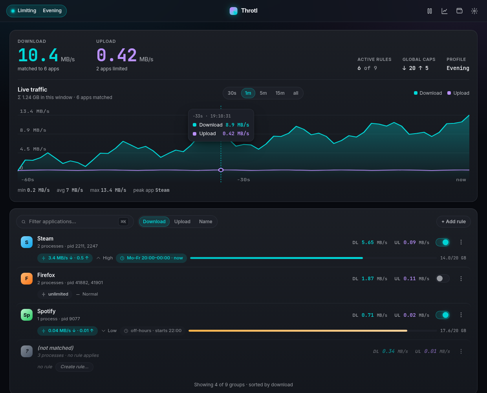
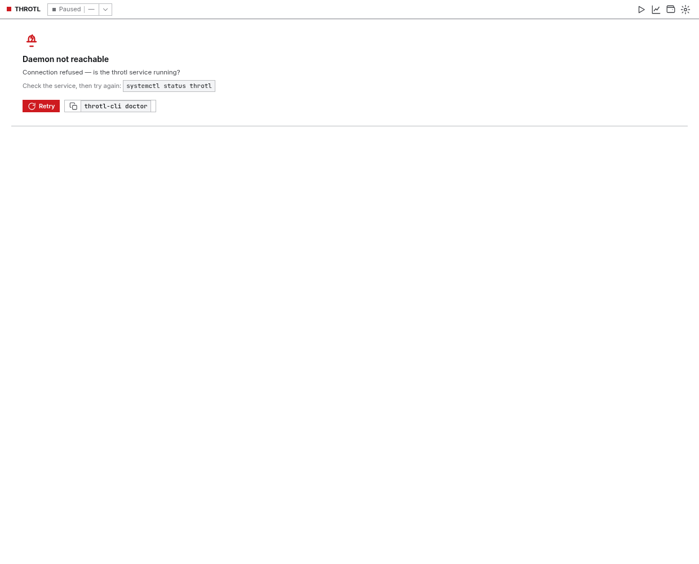

# Installing Throtl

Throtl runs on **Arch / Manjaro / Omarchy, Debian / Ubuntu, Fedora and
openSUSE** (any distro with `systemd` and a package manager). There are two ways
to install it:

1. **[From source](#from-source-one-command)** — `git clone` + one script. Works
   everywhere and always gives you the latest version, but builds the dashboard
   GUI once (5–15 minutes, needs Node + Rust).
2. **[Prebuilt packages](#prebuilt-packages)** — download a `.deb`/`.rpm` from
   the [Releases](https://github.com/Flenser42/throtl/releases) page. No build,
   but you assemble the pieces by hand.

Not sure which to pick? If you just want it to work with one command, use
**from source**. If you're on Debian/Ubuntu/Fedora and don't want to install
Node/Rust, use **prebuilt**.

> The dashboard is a **Tauri 2** app. Its runtime needs **WebKitGTK 4.1**,
> which the installer installs for you automatically (see
> [system packages](#system-packages)).

---

## System packages

Throtl needs three system-level things. `install.sh` installs them itself, but
here they are in case you want to do it by hand:

| Component | Arch / Omarchy | Debian / Ubuntu | Fedora | openSUSE |
|---|---|---|---|---|
| Live traffic (`nethogs`) | `nethogs` | `nethogs` | `nethogs` | `nethogs` |
| Shaper (`tc`) | `iproute2` | `iproute2` | `iproute` | `iproute2` |
| Dashboard runtime | `webkit2gtk-4.1` | `libwebkit2gtk-4.1-0` | `webkit2gtk4.1` | `libwebkit2gtk-4_1-0` |

On **Fedora**, note the shaper package is called `iproute` (not `iproute2`).
On **RHEL/CentOS/AlmaLinux/Rocky ≤ 9**, only WebKitGTK 4.0 is available
(`webkit2gtk3`) — the dashboard needs 4.1, so use a newer base or a Flatpak.

---

## From source (one command)

Works on every supported distro. The script detects your package manager
(`pacman` / `apt` / `dnf` / `zypper`) and installs the right system packages.

```bash
git clone https://github.com/Flenser42/throtl.git
cd throtl
sudo ./setup/install.sh
```

What the script does:

1. installs the system packages (table above),
2. creates `/opt/throtl/venv` and installs [TrafficToll](https://github.com/cryzed/TrafficToll),
3. copies the daemon/CLI and symlinks `throtl-cli` / `throtl-daemon` into `/usr/local/bin`,
4. creates `/etc/throtl/config.toml` and `/run/throtl`,
5. installs and starts the `throtl` systemd service,
6. removes leftovers from the old GTK GUI,
7. **builds and installs the dashboard GUI** for your user,
8. installs the polkit helper so the GUI can re-grant socket access.

### The dashboard build (step 7)

The first build compiles Rust and takes **5–15 minutes**. The installer shows a
live progress bar (percentage + phase labels), so it is working, not stuck —
don't interrupt it. Later installs reuse the cached build and finish in seconds,
and the cache is freshness-checked: if any source file changed (e.g. after
`git pull`), the dashboard is rebuilt automatically.

To build the dashboard you need **Node 20+** and **Rust** (installed via
[rustup](https://rustup.rs)), plus the *build* (not just runtime) WebKitGTK
packages for your distro:

```bash
# Debian / Ubuntu
sudo apt install libwebkit2gtk-4.1-dev build-essential libssl-dev \
  libayatana-appindicator3-dev librsvg2-dev
# Fedora
sudo dnf install webkit2gtk4.1-devel openssl-devel \
  libappindicator-gtk3-devel librsvg2-devel
sudo dnf group install "C Development Tools and Libraries"
# Arch / Omarchy
sudo pacman -S --needed webkit2gtk-4.1 base-devel openssl libappindicator-gtk3 librsvg
```

> Don't want to build the GUI? Skip it and only install daemon + CLI:
> `sudo ./setup/install.sh --no-app`. You can add the dashboard later with
> `./setup/install-app.sh`.

### Useful flags

| Flag | Effect |
|---|---|
| `--no-app` | daemon + CLI only, skip the GUI |
| `--with-widget` | also install the bar widget for your shell |
| `--with-omarchy` / `--with-waybar` | force a specific bar widget |

---

## Prebuilt packages

Every [release](https://github.com/Flenser42/throtl/releases) carries prebuilt
artifacts (built by CI). Download the ones for your distro:

| Distro | Backend (daemon + CLI) | Dashboard (GUI) |
|---|---|---|
| Debian / Ubuntu | `throtl_…_all.deb` | `throtl-app_…_amd64.deb` |
| Fedora | — (use `install.sh --no-app`) | `throtl-app-….rpm` |
| Arch / Omarchy | [AUR `throtl`](https://aur.archlinux.org/packages/throtl) | build via `install-app.sh` |

For example, on Debian/Ubuntu:

```bash
sudo dpkg -i throtl_0.14.1_all.deb throtl-app_0.14.1_amd64.deb
sudo apt-get -f install   # pull in any missing dependencies
```

> The prebuilt dashboard `.deb`/`.rpm` still needs the WebKitGTK 4.1 runtime
> from the [table above](#system-packages) if your system doesn't already have it.

---

## After installing

The daemon socket is owned by `root:throtl` (`0660`), so your user needs to be
in the `throtl` group. `install.sh` adds you, but **groups only apply in a new
session** — log out and back in once, or run:

```bash
newgrp throtl
```

Then verify it works:

```bash
throtl-cli status          # daemon + shaping state
throtl-cli doctor          # diagnose the whole setup
throtl-app                 # open the dashboard
```



---

## Troubleshooting

- **"Permission denied" on the socket** — your session still has the old group.
  Run `newgrp throtl` or log out/in. `throtl-cli doctor` detects this.
- **`tt` not found** — TrafficToll isn't in the venv. Re-run
  `sudo ./setup/install.sh` (it installs `traffictoll` into `/opt/throtl/venv`).
- **No process list in the GUI** — the daemon couldn't start `nethogs`. Check
  `throtl-cli status` and `systemctl status throtl`.
- **Limits don't seem to apply** — verify the interface
  (`throtl-daemon --interface tailscale0` for VPNs). See the
  [README](https://github.com/Flenser42/throtl#verifying-that-limits-really-work).
- **Prioritisation does nothing** — set a global download/upload cap first.
- **The dashboard shows "service missing"** — the daemon isn't reachable:

  

---

## Uninstall

```bash
sudo ./setup/uninstall.sh          # daemon + CLI
sudo ./setup/uninstall.sh --purge  # also remove config and code
```

The dashboard is per-user; remove it by hand:

```bash
rm -rf ~/.local/opt/throtl ~/.local/bin/throtl-app \
       ~/.local/share/applications/throtl-app.desktop \
       ~/.local/share/icons/hicolor/scalable/apps/throtl-app.svg
```

---

## Next steps

- [README](https://github.com/Flenser42/throtl) — full feature tour and usage.
- [TESTING.md](TESTING.md) — how to verify limits actually throttle.
- [RELEASING.md](RELEASING.md) — how releases are cut.
- [Widgets](https://github.com/Flenser42/throtl#widgets) — the Omarchy/Waybar bar widget.
