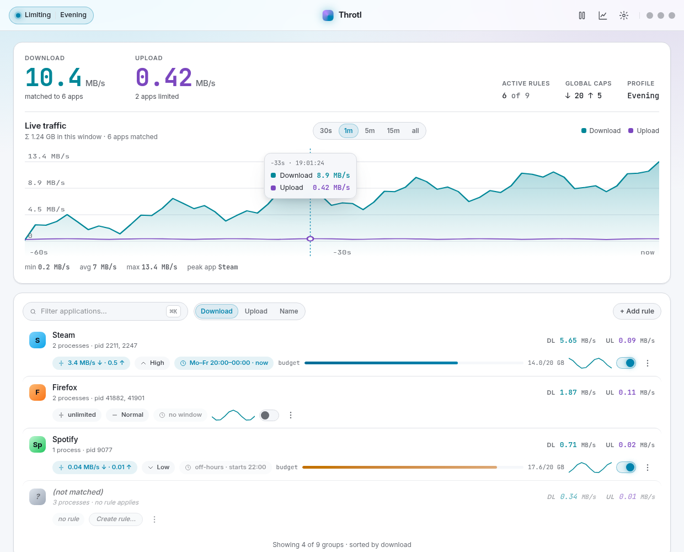
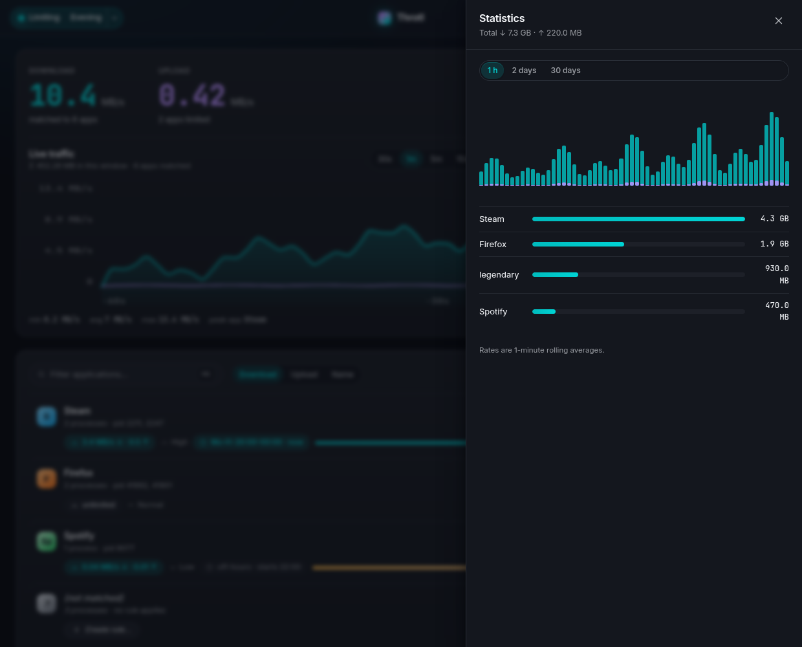
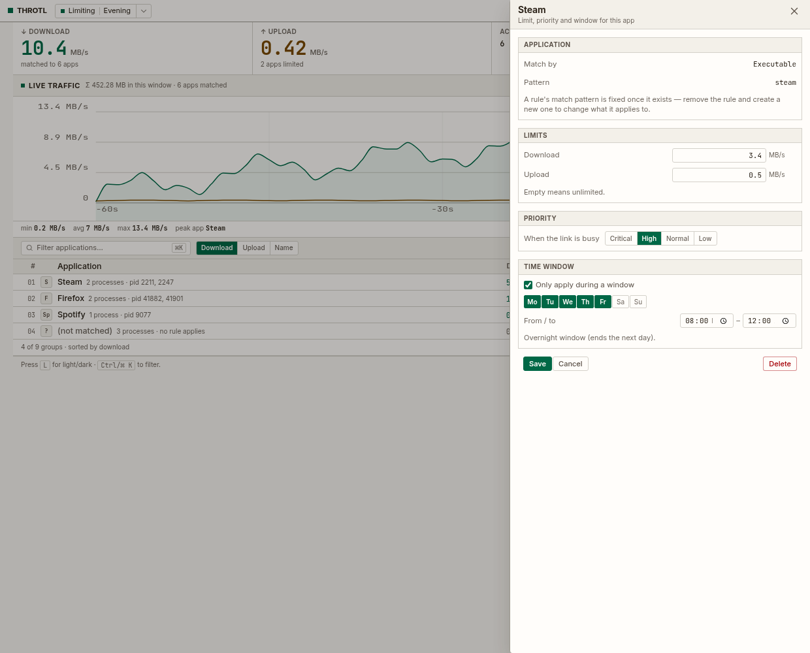

# Using Throtl

A quick tour of the dashboard and CLI — what everything does and how to do the
common tasks. If you haven't installed yet, start with
[INSTALL.md](INSTALL.md).

## Open the dashboard

```bash
throtl-app
```

…or launch **Throtl** from your app menu. The window is one **monitor** surface:
a header with the live totals, the bandwidth graph, and the application list.

<p align="center">
  <a href="images/dashboard-light.png">
    
  </a>
</p>

- **Graph** — download/upload over time. Hover for a crosshair and a tooltip
  (click to pin it); switch the window with `30s / 1m / 5m / 15m / all`.
- **Applications** — every app using the connection: its rate, limit, priority,
  an **arm switch** and a `⋯` menu. Filter with `Ctrl/⌘ K`, sort by
  download/upload/name.
- **Header** — shaping on/off, the profile pill (and Schedule), theme (`L`).

## The sheets

Everything else opens as a right-side sheet:

| Sheet | What it's for |
|---|---|
| **Statistics** | history (1 h / 2 days / 30 days), a chart and per-app breakdown |
| **Budgets** | global + per-app rolling day/week volume limits |
| **Settings** | theme, density, unit, interface, startup, updates, export/import |
| **Global limits** | download/upload caps, floor and priorities |
| **Rule editor** | create/edit a rule (limit, priority, time window) |

<p align="center">
  <a href="images/dashboard-stats.png">
    
  </a>
  <a href="images/dashboard-rule.png">
    
  </a>
</p>

## Common tasks

**Limit one app** — find it in the list, `⋯` → **Edit rule** (or **Add rule**),
set download/upload limits and a priority.

**Cap everything** — Overview card → **Global limits** → set a download/upload
cap.

**Give an app a time window** — edit a rule → add a weekday + time range
(e.g. "Firefox, Mon–Fri 20:00–00:00"); the rule only applies inside it.

**Set a budget** — **Budgets** sheet → set a global (or per-app) day/week
volume. You get a desktop alert at 80 %, and optionally throttling to a floor
once it's exceeded (`enforce` / `floor`).

**Switch profiles** — header pill → pick a profile, or edit the **Schedule** to
switch automatically by day/time.

**Start on login** — **Settings → Startup** (runs minimised to the tray).

## Command palette

`Ctrl/⌘ P` opens a searchable list of actions — focus the filter, add a rule,
open a sheet, switch profile, toggle theme or shaping. Arrows + Enter run,
`Esc` closes.

## CLI

Everything the GUI does, scriptable:

```bash
throtl-cli status
throtl-cli list-processes
throtl-cli set-global --download-limit 2mbps --upload-limit 1mbps
throtl-cli set-process --name Firefox --exe /usr/lib/firefox/firefox \
    --download-limit 2mbps --priority hoch
throtl-cli budget-set --day 20gb
throtl-cli monitor
```

See the [CLI reference](https://github.com/Flenser42/throtl#cli) in the README
for the full command list.

## Keyboard

| Shortcut | Action |
|---|---|
| `L` | Toggle light/dark |
| `Ctrl/⌘ K` | Focus the application filter |
| `Ctrl/⌘ P` | Open the command palette |
| `Esc` | Close the open sheet or menu |

---

[Install](INSTALL.md) · [Testing](TESTING.md) · [Releasing](RELEASING.md)
